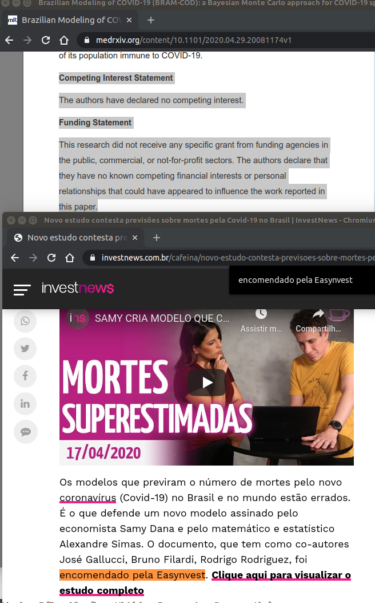
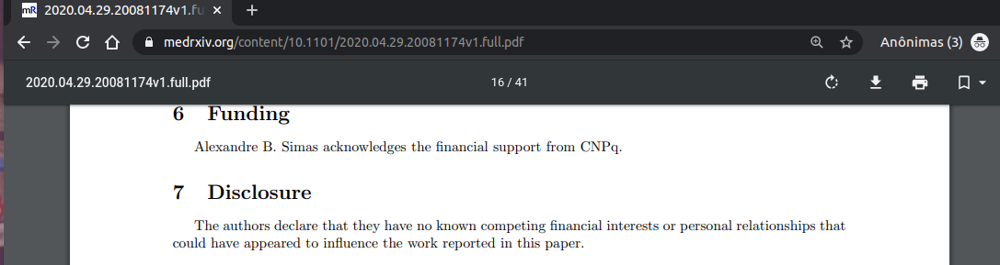

# Arquivos sobre potencial conflitos de interesse no BRAM-COD
> Potencial conflito de interesses é explicitamente omitido no preprint do
> `Brazilian Modeling of COVID-19 (BRAM-COD)`
> [DOI: doi.org/10.1101/2020.04.29.20081174]

Este foi criado para armazenar arquivos extras da discussão iniciada neste
tópico no Reddit r/coronabr: <https://www.reddit.com/r/coronabr/comments/ge9tth/potencial_conflito_de_interesses_%C3%A9_explicitamente/>

---

<!-- TOC -->

- [Arquivos sobre potencial conflitos de interesse no BRAM-COD](#arquivos-sobre-potencial-conflitos-de-interesse-no-bram-cod)
    - [Links rapidos](#links-rapidos)
        - [Discussões](#discussões)
        - [Fonte de material citado](#fonte-de-material-citado)
        - [Imagens](#imagens)

<!-- /TOC -->

---

## Links rapidos

### Discussões
- **Reddit**: 
  - <https://www.reddit.com/r/coronabr/comments/ge9tth/potencial_conflito_de_interesses_%C3%A9_explicitamente/>

### Fonte de material citado

- **Exemplos de referências sobre potenciais conflitos de interesse NÃO citadas no pre-print**
  - **<https://investnews.com.br/cafeina/novo-estudo-contesta-previsoes-sobre-mortes-pela-covid-19-no-brasil/>**
  - Cópia de segurança:
    - <http://archive.vn/s5bh4>
    - [2020-05-06T01:33Z_investnews.com.br_Novo-estudo-contesta-previsoes-sobre-mortes-pela-Covid-19-no-Brasil-InvestNews.pdf](2020-05-06T01:33Z_investnews.com.br_Novo-estudo-contesta-previsoes-sobre-mortes-pela-Covid-19-no-Brasil-InvestNews.pdf)
- **O preprint**
  - **<https://www.medrxiv.org/content/10.1101/2020.04.29.20081174v1>**
    - Cópia de segurança:
      - <http://archive.vn/iGkEe> 
      - [2020-05-06T01:39Z_medrxiv.org_Brazilian-Modeling-of-COVID-19-(BRAM-COD)-a-Bayesian-Monte-Carlo-approach-for-COVID-19-spread-in-a-limited-data-set-context-medRxiv.pdf](2020-05-06T01:39Z_medrxiv.org_Brazilian-Modeling-of-COVID-19-(BRAM-COD)-a-Bayesian-Monte-Carlo-approach-for-COVID-19-spread-in-a-limited-data-set-context-medRxiv.pdf)
  - **<https://www.medrxiv.org/content/10.1101/2020.04.29.20081174v1.full.pdf>**
    - Cópia de segurança:
      - [2020-05-06T01:33Z_medrxiv.org(paper-pre-print)_2020.04.29.20081174v1.full.pdf](2020-05-06T01:33Z_medrxiv.org(paper-pre-print)_2020.04.29.20081174v1.full.pdf)

### Imagens

