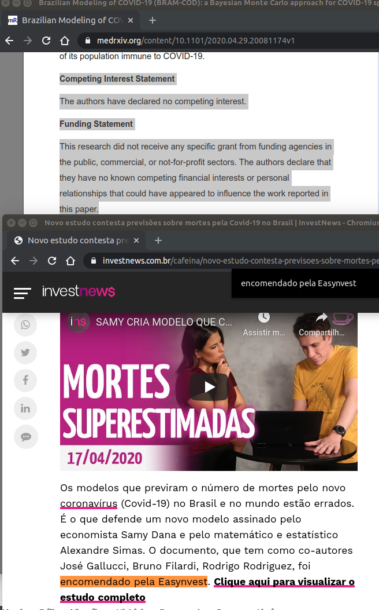
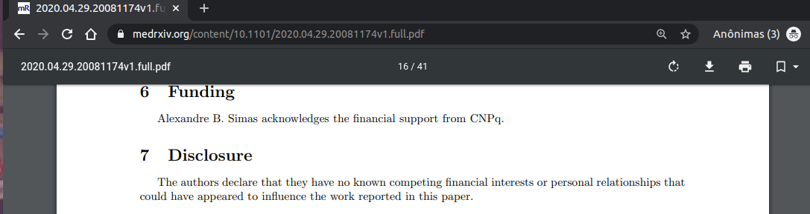

# Arquivos sobre potencial conflitos de interesse no BRAM-COD

---
> **Projeto arquivado. Conteúdo original será mantido por questões históricas**
> 
> Conforme [issues/2#issuecomment-728668416](https://github.com/covid-taskforce-cplp/BRAM-COD-conflitos-de-interesse/issues/2#issuecomment-728668416)
> Muita discussão em torno desse topico, do `covid-taskforce-cplp/BRAM-COD-conflitos-de-interesse`, foram tanto feitas em privado como em trocas de tweets. Um dos autores que mais destaque do BRAM-COD chegou a bloquear minha conta pessoal de twitter, porém os demais foram mais razoáveis.
> 
> Inclusive poucas semanas depois foram mais claros tanto na revisão seguinte, como em tweets (inclusive da pessoa que me bloqueou) passou a tomar mais consciência sobre se dizer completamente isento. Outra coisa que fez diferença é que o modelo matemático que propuseram no final ficou mais alinhado a um que reclamavam nas redes sociais como "sendo errado". Isso isoladamente já ajudou a terem mais humildade.
> 
> Em função do dito acima, tanto as discussões em privado, tweets, pastas compartilhadas do Google Docs, etc, vamos arquivar o `covid-taskforce-cplp/BRAM-COD-conflitos-de-interesse`.
> 
> Obrigado a todos!

---

> **Coleção de potenciais evidências de ocultação intencional de conflitos
> de interesse no ["Brazilian Modeling of COVID-19(BRAM-COD)"](https://www.medrxiv.org/content/10.1101/2020.04.29.20081174v1), um artigo não revisado por pares e que está sendo amplamente usado para instigar redução de recomendações de saúde internacionais no Brasil**

Nota: sugestões de mais evidências podem ser enviadas de forma anônima pelo
e-mail de _Emerson Rocha <rocha@ieee.org>_.

<!--
Este foi criado para armazenar arquivos extras da discussão iniciada neste
tópico no Reddit r/coronabr: <https://www.reddit.com/r/coronabr/comments/ge9tth/potencial_conflito_de_interesses_%C3%A9_explicitamente/>

-->

---

<!-- TOC -->

- [Arquivos sobre potencial conflitos de interesse no BRAM-COD](#arquivos-sobre-potencial-conflitos-de-interesse-no-bram-cod)
    - [Links rapidos](#links-rapidos)
        - [Discussões](#discussões)
        - [Fonte de material citado](#fonte-de-material-citado)
        - [Autores do BRAM-COD](#autores-do-bram-cod)
    - [Definição de o que é conflito de interesse](#definição-de-o-que-é-conflito-de-interesse)
        - [Definição usada pelo ICMJE - International Committee of Medical Journal Editors](#definição-usada-pelo-icmje---international-committee-of-medical-journal-editors)
        - [Imagens](#imagens)
- [Licença](#licença)

<!-- /TOC -->

---

## Links rapidos

### Discussões
- **Reddit**: 
  - <https://www.reddit.com/r/coronabr/comments/ge9tth/potencial_conflito_de_interesses_%C3%A9_explicitamente/>

### Fonte de material citado

- **Exemplos de referências sobre potenciais conflitos de interesse NÃO citadas no pre-print**
  - **<https://investnews.com.br/cafeina/novo-estudo-contesta-previsoes-sobre-mortes-pela-covid-19-no-brasil/>**
  - Cópia de segurança:
    - <http://archive.vn/s5bh4>
    - [evidencia/2020-05-06T01:33Z_investnews.com.br_Novo-estudo-contesta-previsoes-sobre-mortes-pela-Covid-19-no-Brasil-InvestNews.pdf](evidencia/2020-05-06T01:33Z_investnews.com.br_Novo-estudo-contesta-previsoes-sobre-mortes-pela-Covid-19-no-Brasil-InvestNews.pdf)
- **O preprint**
  - **<https://www.medrxiv.org/content/10.1101/2020.04.29.20081174v1>**
    - Cópia de segurança:
      - <http://archive.vn/iGkEe> 
      - [evidencia/2020-05-06T01:39Z_medrxiv.org_Brazilian-Modeling-of-COVID-19-(BRAM-COD)-a-Bayesian-Monte-Carlo-approach-for-COVID-19-spread-in-a-limited-data-set-context-medRxiv.pdf](evidencia/2020-05-06T01:39Z_medrxiv.org_Brazilian-Modeling-of-COVID-19-(BRAM-COD)-a-Bayesian-Monte-Carlo-approach-for-COVID-19-spread-in-a-limited-data-set-context-medRxiv.pdf)
  - **<https://www.medrxiv.org/content/10.1101/2020.04.29.20081174v1.full.pdf>**
    - Cópia de segurança:
      - [evidencia/2020-05-06T01:33Z_medrxiv.org(paper-pre-print)_2020.04.29.20081174v1.full.pdf](evidencia/2020-05-06T01:33Z_medrxiv.org(paper-pre-print)_2020.04.29.20081174v1.full.pdf)

### Autores do BRAM-COD
Em ordem de citação exata no artigo:

1. **Samy Dana**
    - Fundacao Getulio Vargas (EASP-FGV), Brazil;
    - Twitter: <https://twitter.com/samydana>
    - Facebook: <https://www.facebook.com/pg/samydana/posts/>
    - Google Scholar: <https://scholar.google.com/scholar?q=Samy+Dana+>
2. **Alexandre B. Simas**
    - Mathematics Department, Federal University of Paraiba, Brazil;
    - Twitter: <https://twitter.com/AlexandreIMPA>
    - Google Scholar: <https://scholar.google.com/scholar?q=Alexandre+B+Simas+>
3. **Bruno A. Filardi**
    - Scientific Director of Cancer Institute, Brazil;
    - Twitter: <https://twitter.com/mab_sp125>
    - Google Scholar: <https://scholar.google.com/scholar?q=Bruno+A+Filardi+>
4. **Rodrigo N. Rodriguez**
    - Director of Ubarana Hospital, Taubate, Brazil;
    - Twitter: ???
    - Google Scholar: <https://scholar.google.com/scholar?q=Rodrigo+N+Rodriguez+>
5. **Leandro Lane da Costa Valiengo**
    - University of Sao Paulo, Institute of Psychiatry, Brazil
    - Twitter: ???
    - Google Scholar: <https://scholar.google.com/scholar?q=Leandro+Lane+da+Costa+Valiengo+>
6. **Jose Gallucci-Neto**
    - University of Sao Paulo, Institute of Psychiatry, Brazil
    - Twitter: <https://twitter.com/josegallucci>
    - Google Scholar: <https://scholar.google.com/scholar?q=Jose+Gallucci-Neto+>

## Definição de o que é conflito de interesse

### Definição usada pelo ICMJE - International Committee of Medical Journal Editors

**Esta seção contém tradução assistida por computador e com mínima revisão
manual de conteúdo acessível em <http://www.icmje.org/recommendations/browse/roles-and-responsibilities/author-responsibilities--conflicts-of-interest.html>.
É fornecida aqui apenas como referência rápida para pessoas que não sabem
inglês.**

> #### Divulgação de relações e atividades financeiras e não financeiras e conflitos de interesse
>
> CONTEÚDO DA PÁGINA
> 
> 1.  [Participantes](http://www.icmje.org/recommendations/browse/roles-and-responsibilities/author-responsibilities--conflicts-of-interest.html#one)
> 2.  [Relatando Relacionamentos e Atividades](http://www.icmje.org/recommendations/browse/roles-and-responsibilities/author-responsibilities--conflicts-of-interest.html#two)
> 
> A confiança do público no processo científico e a credibilidade dos artigos publicados dependem, em parte, da transparência com que as relações e atividades de um autor, direta ou topicamente relacionadas a uma obra, são tratadas durante o planejamento, implementação, redação, revisão por pares, edição e publicação de artigos. trabalho científico.
> 
> O potencial de conflito de interesses e viés existe quando o julgamento profissional sobre um interesse primário (como o bem-estar do paciente ou a validade da pesquisa) pode ser influenciado por um interesse secundário (como ganho financeiro). As percepções de conflito de interesses são tão importantes quanto os conflitos de interesse reais.
> 
> Os indivíduos podem discordar sobre se os relacionamentos ou atividades de um autor representam conflitos. Embora a presença de um relacionamento ou atividade nem sempre indique uma influência problemática no conteúdo de um artigo, as percepções de conflito podem corroer a confiança na ciência tanto quanto os conflitos de interesse reais. Por fim, os leitores devem poder julgar se as relações e atividades de um autor são pertinentes ao conteúdo de um artigo. Esses julgamentos requerem divulgações transparentes. A divulgação completa de um autor demonstra um compromisso com a transparência e ajuda a manter a confiança no processo científico.
> 
> As relações financeiras (como emprego, consultoria, propriedade ou opções de ações, honorários, patentes e testemunhos pagos de especialistas) são as mais facilmente identificáveis, as mais frequentemente julgadas como representando potenciais conflitos de interesse e, portanto, com maior probabilidade de minar a credibilidade de a revista, os autores e a própria ciência. Outros interesses também podem representar ou ser percebidos como conflitos, como relacionamentos ou rivalidades pessoais, competição acadêmica e crenças intelectuais.
> 
> Os autores devem evitar entrar em acordos com os patrocinadores do estudo, com ou sem fins lucrativos, que interferem no acesso dos autores a todos os dados do estudo ou que interferem em sua capacidade de analisar e interpretar os dados e de preparar e publicar manuscritos independentemente quando e onde eles escolherem. Políticas que determinam onde os autores podem publicar seus trabalhos violam esse princípio de liberdade acadêmica. Os autores podem ser solicitados a fornecer à revista os contratos em sigilo.
> 
> A falha proposital em relatar os relacionamentos ou atividades especificados no formulário de divulgação da revista é uma forma de má conduta, conforme discutido na seção III.B.
> 
> ##### 1. Participantes
> 
> Todos os participantes no processo de revisão por pares e publicação - não apenas autores, mas também revisores, editores e membros do conselho editorial de revistas - devem considerar e divulgar seus relacionamentos e atividades ao desempenhar suas funções no processo de revisão e publicação de artigos.
> 
> ###### Autores
> 
> Quando os autores enviam um manuscrito de qualquer tipo ou formato, eles são responsáveis ​​pela divulgação de todos os relacionamentos e atividades que possam influenciar ou influenciar seu trabalho. O ICMJE desenvolveu um [Formulário de Divulgação](http://www.icmje.org/downloads/coi_disclosure.pdf) para facilitar e padronizar as divulgações dos autores. Os periódicos membros do ICMJE exigem que os autores usem este formulário, e o ICMJE incentiva outros periódicos a adotá-lo.
> 
> ###### Revisão por pares
> 
> Os revisores devem ser solicitados no momento em que são solicitados a criticar um manuscrito se tiverem relacionamentos ou atividades que possam complicar sua revisão. Os revisores devem divulgar aos editores quaisquer relacionamentos ou atividades que possam influenciar suas opiniões sobre o manuscrito e devem se recusar a revisar manuscritos específicos, se existir o potencial de viés. Os revisores não devem usar o conhecimento do trabalho que estão revisando antes de sua publicação para promover seus próprios interesses.
> 
> ###### Editores e equipe de periódicos
> 
> Os editores que tomam decisões finais sobre os manuscritos devem se recusar das decisões editoriais se tiverem relacionamentos ou atividades que apresentem potenciais conflitos relacionados aos artigos em consideração. Outros membros da equipe editorial que participam de decisões editoriais devem fornecer aos editores uma descrição atual de seus relacionamentos ou atividades (como eles podem se relacionar a julgamentos editoriais) e se recusar a tomar quaisquer decisões nas quais exista um interesse que represente um potencial conflito. A equipe editorial não deve usar as informações obtidas através do trabalho com manuscritos para fins particulares. Os editores devem publicar regularmente suas próprias declarações de divulgação e as de sua equipe de periódicos. Os editores convidados devem seguir estes mesmos procedimentos.
> 
> Os periódicos devem tomar precauções extras e ter uma política declarada de avaliação de manuscritos submetidos por indivíduos envolvidos em decisões editoriais. Mais orientações estão disponíveis na [COPE](https://publicationethics.org/files/A_Short_Guide_to_Ethical_Editing.pdf) e na [WAME](http://wame.org/conflict-of-interest-in-peer-reviewed-medical-journals) .
> 
> ##### 2. Relatando Relacionamentos e Atividades
> 
> Os artigos devem ser publicados com declarações ou documentos comprovativos, como o ICMJE Disclosure Form, declarando:
> 
> -   Relações e atividades dos autores; e
> -   Fontes de apoio ao trabalho, incluindo nomes de patrocinadores, juntamente com explicações sobre o papel dessas fontes, se houver, no desenho do estudo; coleta, análise e interpretação de dados; redação do relatório; quaisquer restrições relativas à submissão do relatório para publicação; ou uma declaração declarando que a fonte de suporte não teve esse envolvimento ou restrições em relação à publicação; e
> -   Se os autores tiveram acesso aos dados do estudo, com uma explicação da natureza e extensão do acesso, incluindo se o acesso está em andamento.
> 
> Para apoiar as afirmações acima, os editores podem solicitar que os autores de um estudo patrocinado por um financiador com um interesse proprietário ou financeiro no resultado assine uma declaração, como "Eu tive acesso total a todos os dados deste estudo e tomo completa responsabilidade pela integridade dos dados e pela precisão da análise dos dados. ”

### Imagens

**POR FAZER: organizar melhor as imagens em destaque**.

# Licença

Na medida do possível segundo a lei as pessoas autoras renuciam a todos os
direitos autorais e direitos conexos ou vizinhos a este trabalho para o
[Domínio Público](UNLICENSE).
